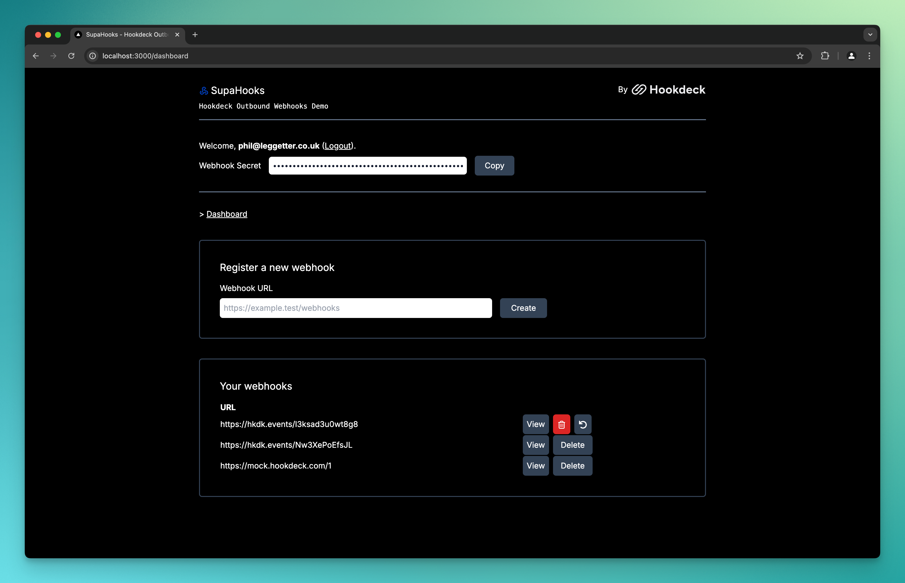

# SupaHooks: Outbound Webhooks Template for Hookdeck</h1>

A template demonstrating using [Hookdeck](https://hookdeck.com?ref=github-outbound-webhooks-template) as your outbound webhook infrastructure.



## About

[Hookdeck](https://hookdeck.com?ref=github-outbound-webhooks-template) is an [event gateway](https://hookdeck.com/blog/event-gateway-definition?ref=github-outbound-webhooks-template): infrastructure that supports use cases, including receiving webhooks, sending webhooks, and connecting third-party services.

This template provides the basic building blocks for registering and managing webhook subscriptions with Hookdeck.

Specifically:

- Each webhook subscription is represented within Hookdeck as a [Connection](https://hookdeck.com/docs/connections?ref=github-outbound-webhooks-template)
- A Connection has a [Destination](https://hookdeck.com/docs/destinations?ref=github-outbound-webhooks-template), representing the webhook endpoint.
- A Connection also has a [Source](https://hookdeck.com/docs/sources?ref=github-outbound-webhooks-template), which a webhook publisher should make an authenticated request to publish an event.

## Getting Started

### App Dependencies

Install the project dependencies:

```bash
npm i
```

### Credentials

[Signup for Hookdeck](https://dashboard.hookdeck.com?ref=github-outbound-webhooks-template), and from within a project, get your **API key** and **signing secret** from **Settings -> Secrets**.

[Signup for Supabase](https://supabase.com/dashboard/sign-up?ref=github-outbound-webhooks-template), create a new project, and get your Supabase URL and Anon Key.

Add the credentials for Hookdeck and Supabase to a `.env.local` file along with a `PUBLISH_KEY`, which should be a unique key that enables webhooks to be triggered:

```.env.local
# Get these values from Project Settings -> Secrets in the Hookdeck Dashboard
HOOKDECK_API_KEY=<your_hookdeck_project_api_key>
HOOKDECK_SIGNING_SECRET=<your_hookdeck_project_signing_secret>

# Generate a secure value for this key
# It is used to authenticate Supabase Database Webhook events
HOOKDECK_PRODUCT_UPDATE_WEBHOOK_KEY=<add_your_own_unique_key_here>

# Get these values from Project Settings -> Configuration -> API in the Supabase Dashboard
NEXT_PUBLIC_SUPABASE_URL=<your_supabase_project_url>
NEXT_PUBLIC_SUPABASE_ANON_KEY=<your_supabase_anon_key>

# Generate a secure value for this key
# It is used to authenticate the publishing of webhook events
PUBLISH_KEY=<add_your_own_unique_key_here>
```

### Database and Hookdeck

Run the following to generate your database schema:
If you have not logged in with the Hookdeck CLI (a project dev dependency), you will do so when running the above command.

Copy the contents of [supabase/schema.sql](supabase/schema.sql) into the Supabase SQL editor and run it to create your schema.

This includes creating a `products` table that can be used for testing using [Supabase Database Webhooks](https://supabase.com/docs/guides/database/webhooks?ref=github-outbound-webhooks-template) as triggers for the SupaHooks outbound webhook notifications.

### Authentication

The project uses [Server-Side Auth for Next.js](https://supabase.com/docs/guides/auth/server-side/nextjs?ref=github-outbound-webhooks-template). So, go to the [Auth templates](https://supabase.com/dashboard/project/_/auth/templates?ref=github-outbound-webhooks-template) page in your dashboard. In the Confirm signup template, change `{{ .ConfirmationURL }}` to `{{ .SiteURL }}/auth/confirm?token_hash={{ .TokenHash }}&type=signup`.

## Run SupaHooks

Run the development server:

```bash
npm run dev
```

In another terminal window, create a local tunnel with the Hookdeck CLI:

```bash
npm run hookdeck:local
```

Try out the app:

- Open [http://localhost:3000](http://localhost:3000).
- Sign up for an account.
- Create a webhook. Hint: Create a new Hookdeck Connection to test receiving webhooks.
- View the webhooks and send test payloads using the **Test** button.
- Use the table editor in Supabase and add rows to the `product` table to trigger Database Webhooks.

## Learn More

- [Hookdeck Documentation](https://hookdeck.com/docs?ref=github-outbound-webhooks-template)
- [Supabase Documentation](https://supabase.com/docs?ref=github-outbound-webhooks-template)
- [Next.js](https://nextjs.org)
