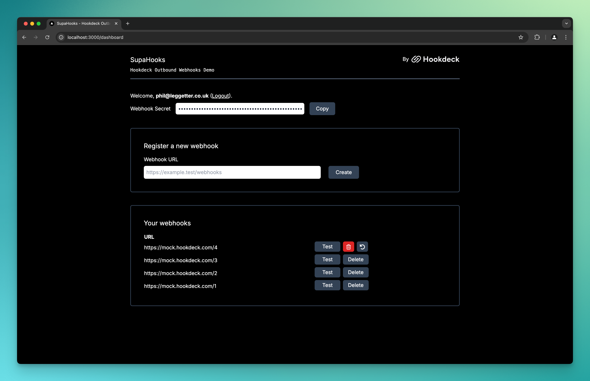

# Outbound Webhooks Demo for Hookdeck

A demo of using [Hookdeck](<(https://hookdeck.com?ref=github-outbound-webhooks-demo) as your outbound webhook infrastructure.



## Getting Started

[Signup for Hookdeck](https://dashboard.hookdeck.com?ref=github-outbound-webhooks-demo), and from within a project, get your API key from **Settings -> Secrets**.

Add the Hookdeck API key to a `.env.local` file:

```
HOOKDECK_API_KEY=<API_KEY>
```

Install the project dependencies:

```bash
npm i
```

Run the development server:

```bash
npm run dev
```

Open [http://localhost:3000](http://localhost:3000) with your browser to see the result.

## Learn More

- [Hookdeck Documentation](https://hookdeck.com/docs?ref=github-outbound-webhooks-demo)
- [Next.js](https://nextjs.org)
